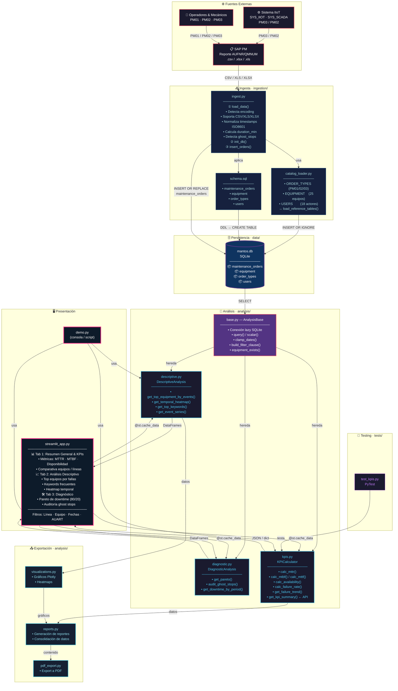
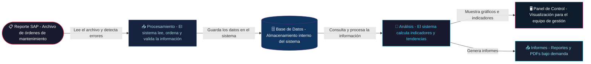
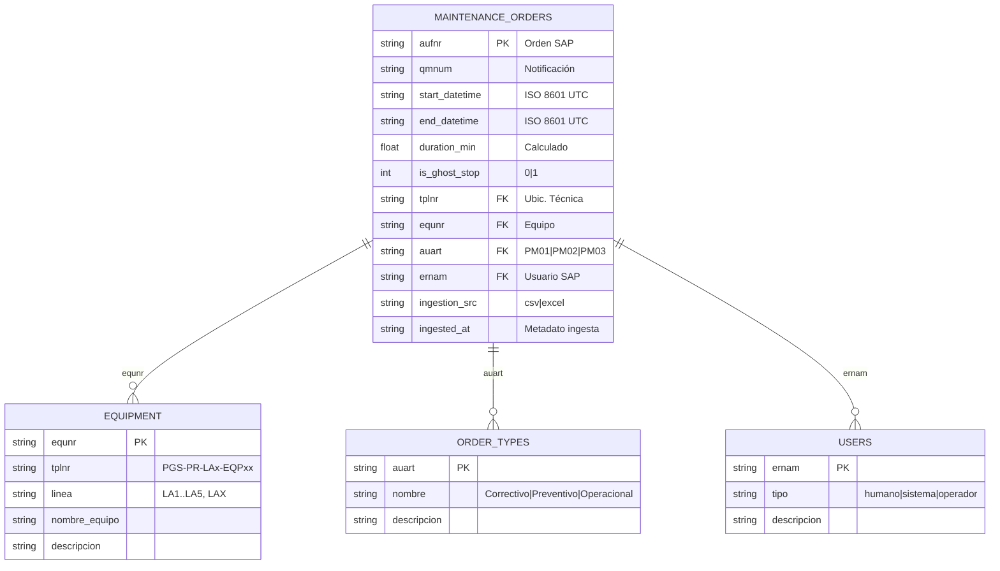

# 🏭 MantOS — Mapa Arquitectónico

> **Planta Galletera Sur** · Sistema de Análisis de Mantenimiento  
> Alcance: Ingesta → Análisis (Descriptivo, Diagnóstico, KPIs) → Presentación

---

## Diagrama Principal (C4 — Nivel Contenedor)

---

## Flujo de Datos Simplificado

### ¿Qué ocurre en cada paso?

| Paso | ¿Qué es? | ¿Qué hace el sistema? |
|:---:|---|---|
| 1 | **Reporte SAP** | El área de mantenimiento exporta el historial de órdenes de trabajo desde SAP |
| 2 | **Procesamiento** | El sistema lee el archivo, detecta fechas incorrectas, calcula tiempos de parada y filtra registros duplicados o vacíos |
| 3 | **Base de Datos** | Toda la información queda almacenada de forma ordenada: equipos, usuarios, tipos de orden y eventos de mantenimiento |
| 4 | **Análisis** | El sistema calcula automáticamente los indicadores clave: tiempo promedio de reparación, disponibilidad de equipos, equipos con más fallas, etc. |
| 5 | **Panel de Control** | El jefe o supervisor accede a un tablero web con gráficos interactivos, filtros por línea, equipo y fechas |
| 6 | **Informes** | Bajo demanda, el sistema genera reportes y documentos PDF con los resultados del período |

---

## Estructura de Tablas SQLite

---

## Resumen de Responsabilidades

| Módulo | Clase Principal | Responsabilidad |
|---|---|---|
| `ingestion/ingest.py` | — (funciones) | Leer SAP export → limpiar → cargar SQLite |
| `ingestion/catalog_loader.py` | — (constantes) | Datos de referencia: equipos, usuarios, tipos |
| `ingestion/schema.sql` | — (DDL) | Definición de todas las tablas |
| `analysis/base.py` | `AnalysisBase` | Conexión DB, helpers SQL/fecha, filtros comunes |
| `analysis/descriptive.py` | `DescriptiveAnalysis` | Top equipos, heatmaps, keywords |
| `analysis/diagnostic.py` | `DiagnosticAnalysis` | Pareto 80/20, auditoría ghost stops |
| `analysis/kpis.py` | `KPICalculator` | MTTR, MTBF, Disponibilidad, Tasa de fallas |
| `analysis/reports.py` | — | Consolidación de reportes |
| `analysis/pdf_export.py` | — | Export a PDF |
| `analysis/visualizations.py` | — | Gráficos Plotly reutilizables |
| `streamlit_app.py` | — (UI) | Dashboard web: 3 tabs, filtros interactivos |

> **Excluido del alcance:** `analysis/predictive.py` · `analysis/prescriptive.py`
