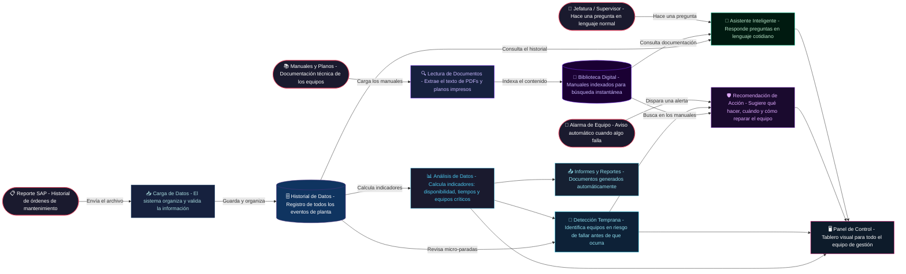
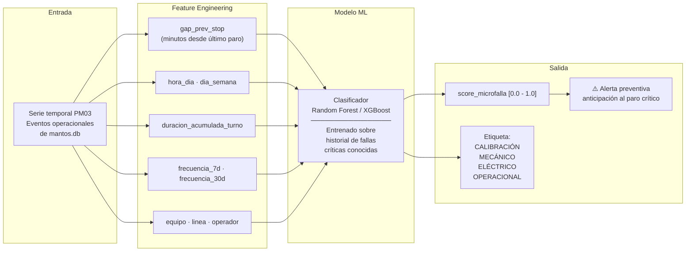
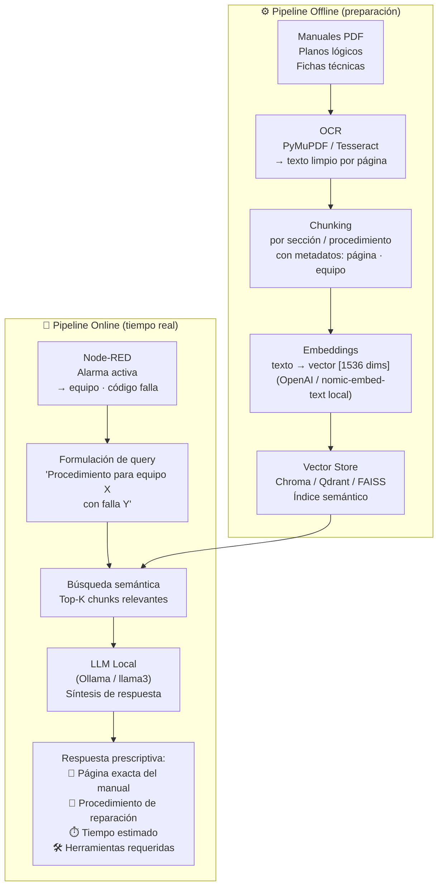
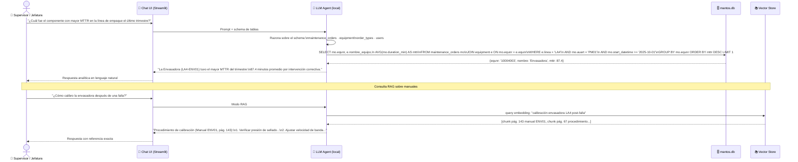
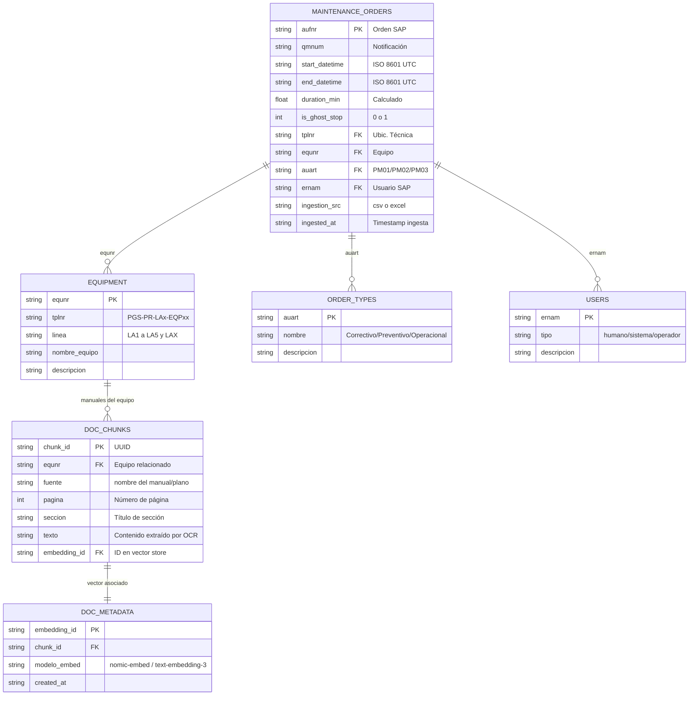
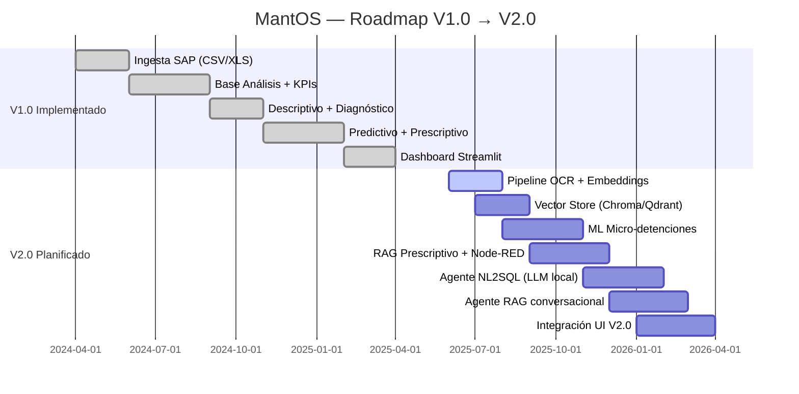

# 🏭 MantOS V2.0 — Arquitectura del Sistema
> **Planta Galletera Sur** · Sistema Inteligente de Análisis de Mantenimiento  
> Versión: 2.0 (Roadmap) — Basado en implementación V1.0 existente

---

> [!NOTE]
> Los componentes marcados con 🟢 están **implementados en V1.0**.  
> Los marcados con 🔵 son **nuevos pilares planificados para V2.0**.

---

## Diagrama de Arquitectura Completa (C4 — Nivel Contenedor)

```mermaid
flowchart TD

    %% ─────────────────────────────────────────
    %% FUENTES EXTERNAS
    %% ─────────────────────────────────────────
    subgraph EXT["🌐 Fuentes Externas"]
        SAP["📋 SAP PM\nCSV / XLS / XLSX\nAUFNR · QMNUM · AUART"]
        IIOT["⚙️ IIoT / SCADA / PLC\nSYS_IIOT · SYS_SCADA\nEventos PM03 / PM02"]
        OPR["👷 Operadores & Mecánicos\n18 actores catalogados\nPM01 · PM02 · PM03"]
        MANUALES["📚 Manuales Técnicos\nPlanos eléctricos · PDFs\nDocumentación de maquinaria"]
        NODERED["🔴 Node-RED\nSistema de alarmas\nTrigger de eventos críticos"]
    end

    %% ─────────────────────────────────────────
    %% CAPA DE INGESTA V1.0
    %% ─────────────────────────────────────────
    subgraph ING["📥 Ingesta · ingestion/ 🟢"]
        INGEST["ingest.py\n① load_data() — CSV/XLS/XLSX\n② Normaliza timestamps ISO8601\n③ Calcula duration_min\n④ Detecta ghost_stops\n⑤ init_db() → insert_orders()"]
        CAT["catalog_loader.py\n• 25 equipos (LA1-LA5, LAX)\n• 18 actores del sistema\n• Tipos: PM01/PM02/PM03"]
        SCHEMA["schema.sql\nDDL de todas las tablas"]
    end

    %% ─────────────────────────────────────────
    %% BASE DE DATOS RELACIONAL
    %% ─────────────────────────────────────────
    subgraph DB["🗄️ Persistencia Relacional · data/ 🟢"]
        SQLITE[("mantos.db — SQLite\n─────────────────\n📦 maintenance_orders\n📦 equipment\n📦 order_types\n📦 users")]
    end

    %% ─────────────────────────────────────────
    %% BASE DE DATOS VECTORIAL  (V2.0)
    %% ─────────────────────────────────────────
    subgraph VDB["🔵 Persistencia Vectorial · V2.0"]
        VECTORDB[("Vector Store\nChroma / Qdrant / FAISS\n─────────────────\n📦 doc_chunks\n   texto + embedding\n📦 doc_metadata\n   fuente · página · equipo")]
    end

    %% ─────────────────────────────────────────
    %% ANÁLISIS CLÁSICO V1.0
    %% ─────────────────────────────────────────
    subgraph ANAL["🔬 Análisis Clásico · analysis/ 🟢"]
        BASE["base.py — AnalysisBase\nConexión lazy SQLite\nHelpers: query · scalar\nFiltros: equnr · linea · auart · fechas"]

        DESC["descriptive.py\nDescriptiveAnalysis\n• get_top_equipment_by_events()\n• get_temporal_heatmap()\n• get_top_keywords()\n• get_event_series()"]

        DIAG["diagnostic.py\nDiagnosticAnalysis\n• get_pareto() — regla 80/20\n• audit_ghost_stops()\n• get_recurrence_score()\n• get_downtime_by_period()"]

        KPI["kpis.py — KPICalculator\n• calc_mttr()\n• calc_mtbf() / calc_mttf()\n• calc_availability()\n• calc_failure_rate()\n• get_failure_trend()\n• get_kpi_summary() ← API"]
    end

    %% ─────────────────────────────────────────
    %% PILAR 1: PREDICCIÓN V1.0 + V2.0
    %% ─────────────────────────────────────────
    subgraph PRED["🔮 Pilar 1: Análisis Predictivo"]
        PRED10["predictive.py — V1.0 🟢\nPredictiveAnalysis\n─────────────────────\n• forecast_failure_rate()\n  Regresión lineal sobre\n  serie temporal de fallas\n• calc_risk_score() [0-100]\n  Ponderado: frecuencia 40%\n  tendencia MTBF 30%\n  recurrencia 20%\n  ghost_stops 10%\n• get_risk_ranking()\n• detect_anomalies() Z-score"]

        PRED20["🔵 ML Micro-detenciones — V2.0\nModelos de Clasificación\n─────────────────────────────\n• Ingesta series temporales PM03\n• Feature engineering:\n  gap entre paros · duración · hora\n  día semana · equipo · turno\n• Clasificadores:\n  Random Forest / XGBoost\n• Output: score_microfalla [0-1]\n  etiqueta: CALIBRACIÓN / MECÁNICO\n           ELÉCTRICO / OPERACIONAL\n• Detección de patrones ocultos\n  en micro-paradas acumuladas\n• Alerta preventiva antes de\n  paro crítico de línea"]
    end

    %% ─────────────────────────────────────────
    %% PILAR 2: PRESCRIPTIVO V1.0 + V2.0
    %% ─────────────────────────────────────────
    subgraph PRESC["💊 Pilar 2: Análisis Prescriptivo"]
        PRESC10["prescriptive.py — V1.0 🟢\nPrescriptiveAnalysis\n─────────────────────\n• get_recommendations()\n  Reglas basadas en umbrales:\n  risk_score ≥ 70 → URGENTE\n  risk_score 45-70 → PM02\n  MTTR > 60 min → revisión\n  Disponibilidad < 95%\n• get_action_plan()\n  Prioriza: URGENTE / PLANIFICADO\n           / MONITOREO\n• check_alerts()\n  Severidades: CRITICA/ALTA\n              MEDIA/BAJA"]

        PRESC20["🔵 Prescriptivo por RAG — V2.0\nOCR + Embeddings + LLM\n─────────────────────────────\n• Pipeline OCR:\n  PDF/imagen → texto limpio\n  (PyMuPDF / Tesseract / Azure)\n• Chunking inteligente:\n  por sección de manual\n  por procedimiento técnico\n• Generación de embeddings:\n  texto → vector [768/1536 dims]\n• Retrieval (RAG):\n  alarma → query → Top-K chunks\n• Output prescriptivo:\n  página exacta del manual\n  procedimiento de reparación\n  herramientas requeridas\n  tiempo estimado"]
    end

    %% ─────────────────────────────────────────
    %% PILAR 3: INTERFAZ CONVERSACIONAL V2.0
    %% ─────────────────────────────────────────
    subgraph CONV["💬 Pilar 3: Interfaz Conversacional 🔵 V2.0"]
        NL2SQL["NL → SQL Agent\nLLM Local (Ollama/llama3)\n─────────────────────────────\n• Lenguaje natural → SQL\n  Ejemplo:\n  '¿Cuál fue el MTTR en la\n  línea de empaque el último\n  trimestre?' →\n  SELECT AVG(duration_min)...\n• Schema-aware: conoce tablas\n  y columnas de mantos.db\n• Respuesta analítica exacta\n• Sin necesidad de filtros\n  complejos en la UI"]

        NLRAG["NL → RAG Agent\nLLM Local + Vector Store\n─────────────────────────────\n• '¿Cómo calibro el\n  laminador LA1-LAM01?'\n• Busca en embeddings de\n  manuales técnicos\n• Retorna procedimiento\n  + referencia de página\n• Optimizado para jefaturas\n  y supervisores de turno"]
    end

    %% ─────────────────────────────────────────
    %% EXPORTACIÓN
    %% ─────────────────────────────────────────
    subgraph EXP["📤 Exportación · analysis/ 🟢"]
        VIZ["visualizations.py\nGráficos Plotly reutilizables"]
        REP["reports.py\nConsolidación de reportes"]
        PDF["pdf_export.py\nExport a PDF"]
    end

    %% ─────────────────────────────────────────
    %% PRESENTACIÓN
    %% ─────────────────────────────────────────
    subgraph UI["🖥️ Presentación"]
        STREAM["streamlit_app.py 🟢\n─────────────────────\n📊 Tab 1: KPIs\n   MTTR · MTBF · Disponibilidad\n📈 Tab 2: Descriptivo\n   Top equipos · Heatmap · Keywords\n🛠️ Tab 3: Diagnóstico\n   Pareto 80/20 · Ghost stops\n─────────────────────\n🔵 Tab 4 (V2.0): Predicción\n   Risk ranking · Anomalías\n   ML micro-detenciones\n🔵 Tab 5 (V2.0): Prescriptivo\n   Plan de acción · Alertas\n   RAG sobre manuales\n🔵 Tab 6 (V2.0): Asistente IA\n   Chat NL → SQL / RAG"]
        DEMO["demo.py\nScript de consola"]
    end

    subgraph TEST["🧪 Testing"]
        TKPI["test_kpis.py · PyTest"]
    end

    %% ─────────────────────────────────────────
    %% FLUJO V1.0 — INGESTA
    %% ─────────────────────────────────────────
    SAP  -->|"CSV / XLS / XLSX"| INGEST
    IIOT -->|"PM03 automático"| SAP
    OPR  -->|"PM01 / PM02"| SAP
    INGEST --> CAT
    INGEST --> SCHEMA
    CAT    -->|"INSERT OR IGNORE"| SQLITE
    SCHEMA -->|"DDL"| SQLITE
    INGEST -->|"INSERT OR REPLACE"| SQLITE

    %% FLUJO V1.0 — ANÁLISIS
    SQLITE -->|"SELECT"| BASE
    BASE --> DESC & DIAG & KPI
    DIAG --> PRED10
    KPI  --> PRED10 & PRESC10
    PRED10 --> PRESC10

    %% FLUJO V2.0 — OCR + EMBEDDINGS
    MANUALES -->|"PDF / imagen"| PRESC20
    PRESC20  -->|"chunks + vectores"| VECTORDB
    NODERED  -->|"alarma activa"| PRESC20
    VECTORDB -->|"Top-K chunks"| PRESC20
    VECTORDB -->|"búsqueda semántica"| NLRAG

    %% FLUJO V2.0 — ML MICRO-DETENCIONES
    SQLITE -->|"series PM03"| PRED20

    %% FLUJO V2.0 — CONVERSACIONAL
    SQLITE   -->|"schema + datos"| NL2SQL
    VECTORDB -->|"embeddings docs"| NLRAG

    %% HACIA UI
    DESC    --> STREAM
    DIAG    --> STREAM
    KPI     --> STREAM
    PRED10  --> STREAM
    PRED20  --> STREAM
    PRESC10 --> STREAM
    PRESC20 --> STREAM
    NL2SQL  --> STREAM
    NLRAG   --> STREAM

    DESC --> VIZ
    KPI  --> REP
    VIZ  --> REP
    REP  --> PDF

    TKPI --> KPI
    DEMO --> DESC & DIAG & KPI

    %% ─────────────────────────────────────────
    %% ESTILOS
    %% ─────────────────────────────────────────
    classDef external   fill:#1a1a2e,stroke:#e94560,color:#fff,stroke-width:2px
    classDef ingesta    fill:#16213e,stroke:#0f3460,color:#a8dadc,stroke-width:2px
    classDef db         fill:#0f3460,stroke:#533483,color:#fff,stroke-width:3px
    classDef vdb        fill:#1a0033,stroke:#7b2fff,color:#c9b8ff,stroke-width:2px
    classDef base       fill:#533483,stroke:#e94560,color:#fff,stroke-width:2px
    classDef analisis   fill:#1a1a2e,stroke:#4cc9f0,color:#4cc9f0,stroke-width:2px
    classDef pred       fill:#0d2137,stroke:#00b4d8,color:#90e0ef,stroke-width:2px
    classDef predv2     fill:#003045,stroke:#0096c7,color:#caf0f8,stroke-width:2px,stroke-dasharray:6 3
    classDef presc      fill:#1a0a2e,stroke:#7209b7,color:#c77dff,stroke-width:2px
    classDef prescv2    fill:#200040,stroke:#9d4edd,color:#e0aaff,stroke-width:2px,stroke-dasharray:6 3
    classDef conv       fill:#001a10,stroke:#06d6a0,color:#b7e4c7,stroke-width:2px,stroke-dasharray:6 3
    classDef export     fill:#162032,stroke:#48cae4,color:#90e0ef,stroke-width:2px
    classDef ui         fill:#0d1b2a,stroke:#f72585,color:#fff,stroke-width:3px
    classDef test       fill:#1b1b2f,stroke:#7209b7,color:#c77dff,stroke-width:1px

    class SAP,IIOT,OPR,MANUALES,NODERED external
    class INGEST,CAT,SCHEMA ingesta
    class SQLITE db
    class VECTORDB vdb
    class BASE base
    class DESC,DIAG,KPI analisis
    class PRED10 pred
    class PRED20 predv2
    class PRESC10 presc
    class PRESC20 prescv2
    class NL2SQL,NLRAG conv
    class VIZ,REP,PDF export
    class STREAM,DEMO ui
    class TKPI test
```

---

## Flujo de Datos Simplificado — V2.0

### ¿Qué ocurre en cada paso?

| Paso | ¿Qué es? | ¿Qué hace el sistema? | Estado |
|:---:|---|---|:---:|
| 1 | **Carga del historial SAP** | El área de mantenimiento sube el archivo con todas las órdenes de trabajo del período | 🟢 |
| 2 | **Lectura de manuales** | El sistema escanea y digitaliza los manuales técnicos para poder buscar en ellos instantáneamente | 🔵 |
| 3 | **Análisis de datos** | Se calculan automáticamente los indicadores de mantenimiento: disponibilidad de equipos, tiempos de reparación y equipos con más fallas | 🟢 |
| 4 | **Detección temprana** | El sistema identifica equipos que muestran señales de deterioro antes de que ocurra una parada mayor, usando inteligencia artificial | 🟢 🔵 |
| 5 | **Recomendación de acción** | Cuando se activa una alarma, el sistema sugiere automáticamente qué hacer, qué herramientas usar y en qué página del manual está el procedimiento | 🟢 🔵 |
| 6 | **Asistente de preguntas** | El jefe o supervisor puede escribir una pregunta normal y el sistema le responde con datos exactos del historial o del manual técnico | 🔵 |
| 7 | **Panel de control** | Todo el equipo puede ver el estado de la planta en un tablero visual con gráficos, alertas e indicadores actualizados | 🟢 🔵 |

> 🟢 **Ya disponible** · 🔵 **En desarrollo (V2.0)**

---

## Pilar 1 — ML para Micro-detenciones 🔵

> *"Las micro-paradas acumuladas son invisibles, pero destruyen el OEE del turno."*

**¿Qué resuelve?**
- Las paradas prolongadas son visibles; las micro-paradas de 2-5 minutos repetitivas son **invisibles en KPIs estándar**
- El modelo aprende patrones en la serie PM03 que anteceden un paro crítico PM01
- Permite intervención preventiva antes de que el turno pierda OEE

---

## Pilar 2 — Prescriptivo por OCR + RAG 🔵

> *"El cuello de botella es el técnico buscando en manuales de cientos de páginas."*

**¿Qué resuelve?**
- Reduce drásticamente el **MTTR** eliminando el tiempo de búsqueda en documentación
- El técnico recibe la página exacta del manual sin buscar manualmente
- Conocimiento institucional preservado y accesible en segundos

---

## Pilar 3 — Interfaz Conversacional LLM 🔵

> *"No obligar a una jefatura a estructurar filtros complejos."*

**¿Qué resuelve?**
- Elimina la barrera técnica para jefaturas que no saben construir filtros complejos en dashboards
- Respuestas analíticas en lenguaje natural, exactas y trazables
- Un solo punto de acceso para datos históricos **y** documentación técnica

---

## Diagrama ER Extendido (V2.0)

---

## Tabla de Responsabilidades Completa

| Módulo | Estado | Clase Principal | Responsabilidad |
|---|:---:|---|---|
| `ingestion/ingest.py` | 🟢 V1.0 | — (funciones) | Leer SAP export → limpiar → cargar SQLite |
| `ingestion/catalog_loader.py` | 🟢 V1.0 | — (constantes) | Catálogo: 25 equipos, 18 actores, 3 tipos OT |
| `ingestion/schema.sql` | 🟢 V1.0 | — (DDL) | Definición de tablas relacionales |
| `analysis/base.py` | 🟢 V1.0 | `AnalysisBase` | Conexión lazy SQLite, helpers SQL/fecha, filtros |
| `analysis/descriptive.py` | 🟢 V1.0 | `DescriptiveAnalysis` | Top equipos, heatmaps temporales, keywords |
| `analysis/diagnostic.py` | 🟢 V1.0 | `DiagnosticAnalysis` | Pareto 80/20, ghost stops, recurrencia |
| `analysis/kpis.py` | 🟢 V1.0 | `KPICalculator` | MTTR, MTBF, Disponibilidad, Tasa de fallas |
| `analysis/predictive.py` | 🟢 V1.0 | `PredictiveAnalysis` | Regresión lineal, risk score [0-100], Z-score |
| `analysis/prescriptive.py` | 🟢 V1.0 | `PrescriptiveAnalysis` | Recomendaciones por umbrales, alertas, plan de acción |
| `analysis/reports.py` | 🟢 V1.0 | — | Consolidación y generación de reportes |
| `analysis/pdf_export.py` | 🟢 V1.0 | — | Export a PDF |
| `analysis/visualizations.py` | 🟢 V1.0 | — | Gráficos Plotly reutilizables |
| `streamlit_app.py` | 🟢 V1.0 | — (UI) | Dashboard 3 tabs: KPIs · Descriptivo · Diagnóstico |
| `ingestion/ocr_pipeline.py` | 🔵 V2.0 | `OCRPipeline` | PDF/imagen → texto limpio → chunks con metadatos |
| `ingestion/embedder.py` | 🔵 V2.0 | `DocumentEmbedder` | Chunks → vectores → inserción en Vector Store |
| `analysis/ml_micro_stops.py` | 🔵 V2.0 | `MicroStopClassifier` | Clasificación PM03 → tipo de falla + score preventivo |
| `analysis/rag_prescriptive.py` | 🔵 V2.0 | `RAGPrescriptive` | Alarma → RAG → página de manual + procedimiento |
| `agents/nl2sql_agent.py` | 🔵 V2.0 | `NL2SQLAgent` | Lenguaje natural → SQL → respuesta analítica |
| `agents/rag_agent.py` | 🔵 V2.0 | `RAGAgent` | Lenguaje natural → búsqueda semántica → respuesta |

---

## Roadmap de Implementación

